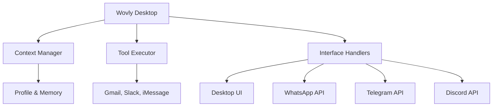

## Overview

Wovly provides multiple chat interfaces so you can interact with your AI assistant from anywhere - at your desk, on your phone, or remotely. All interfaces share the same context, memory, and capabilities, giving you seamless access to your emails, calendar, messages, and tasks regardless of how you connect.

## Available Interfaces

<CardGroup cols={2}>
  <Card title="Desktop Chat" icon="desktop">
    **Primary Interface**

    Full conversational AI with streaming, all tool integrations, visual displays, file attachments, rich formatting
  </Card>

  <Card title="WhatsApp" icon="whatsapp">
    **Remote Control**

    Chat with Wovly from your phone, check emails, send messages, quick answers away from desk
  </Card>

  <Card title="Telegram Bot" icon="telegram">
    **Power User Interface**

    Inline buttons, photo analysis, voice transcription, slash commands for quick access
  </Card>

  <Card title="Discord" icon="discord">
    **Team Collaboration**

    Server integration for team coordination, shared task tracking, collaborative notes (experimental)
  </Card>
</CardGroup>

## Desktop Chat

The main Wovly application provides the richest chat experience.

### Capabilities

<AccordionGroup>
  <Accordion title="Full Conversational AI" icon="comments">
    - Streaming responses in real-time
    - Context-aware from your profile and memory
    - Access to all tool integrations
  </Accordion>

  <Accordion title="Visual Elements" icon="eye">
    - Calendar events with formatting
    - Email threads with structure
    - Task lists with checkboxes
    - Rich markdown support
  </Accordion>

  <Accordion title="File Support" icon="file">
    - Attach screenshots for analysis
    - Upload documents for review
    - Code blocks with syntax highlighting
  </Accordion>
</AccordionGroup>

### Example Queries

```text
"What's on my calendar today?"
"Send an email to Sarah about the Q4 report"
"Search my Slack for messages about the product launch"
"What did the daycare say this week?"
"Create a task to follow up with John tomorrow"
```

### Keyboard Shortcuts

| Shortcut | Action |
|----------|--------|
| `Enter` | Send message |
| `Shift + Enter` | New line |
| `Cmd/Ctrl + K` | Clear conversation |
| `Cmd/Ctrl + L` | Focus input |

## WhatsApp Interface

Control Wovly remotely from your phone.

### Setup

<Steps>
  <Step title="Open Interfaces">
    Go to Interfaces tab in Wovly desktop
  </Step>
  <Step title="Configure WhatsApp">
    Click **Configure WhatsApp**
  </Step>
  <Step title="Scan QR Code">
    Scan with WhatsApp mobile app
  </Step>
  <Step title="Grant Permissions">
    Allow Wovly to send/receive messages
  </Step>
  <Step title="Start Chatting">
    Message Wovly's WhatsApp number
  </Step>
</Steps>

### Capabilities

<CardGroup cols={2}>
  <Card title="Email Queries" icon="envelope">
    "Any important emails today?"
  </Card>
  <Card title="Calendar Checks" icon="calendar">
    "What's on my schedule tomorrow?"
  </Card>
  <Card title="Send Messages" icon="paper-plane">
    "Text my wife I'm running late"
  </Card>
  <Card title="Search" icon="magnifying-glass">
    "Find the email from John about budget"
  </Card>
</CardGroup>

### Example Conversation

<CodeGroup>

```text WhatsApp Chat
You: Any important emails since noon?

Wovly: You have 3 important emails:

1. Sarah Chen (2:15pm) - Q4 Budget Review
   "Need your approval on the updated numbers by EOD"

2. Client Services (1:45pm) - Invoice #4521
   "Payment received, thank you"

3. John Martinez (1:20pm) - Meeting Reschedule
   "Can we move our 4pm to tomorrow at 10am?"

Would you like me to respond to any of these?
```

```text Quick Task Creation
You: Create a task to follow up with Sarah tomorrow at 2pm

Wovly: Task created:
📋 Follow up with Sarah
⏰ Tomorrow at 2:00pm
✓ Reminder will be sent
```

</CodeGroup>

### Security

<Warning>
**WhatsApp Security:**
- Phone number allowlist (only your numbers)
- Session timeout (24 hours inactive)
- End-to-end encryption
- Never exposes passwords or API keys
</Warning>

## Telegram Bot

Advanced interface for power users.

### Setup

<Steps>
  <Step title="Create Bot">
    Message [@BotFather](https://t.me/botfather) to create bot
  </Step>
  <Step title="Get Token">
    Copy the bot token from BotFather
  </Step>
  <Step title="Configure in Wovly">
    Interfaces → Telegram → Enter token
  </Step>
  <Step title="Start Conversation">
    Find your bot and send `/start`
  </Step>
</Steps>

### Commands

| Command | Description |
|---------|-------------|
| `/start` | Initialize bot |
| `/status` | Check Wovly status |
| `/email` | Quick email summary |
| `/calendar` | Today's schedule |
| `/tasks` | List active tasks |
| `/help` | Show commands |

### Advanced Features

<Tabs>
  <Tab title="Inline Buttons">
    ```text
    You: /email

    Wovly: 📧 Email Summary - Feb 21, 2026

    Unread: 12 messages
    Important: 3 messages

    [View Important] [View All] [Compose]
    ```
  </Tab>

  <Tab title="Photo Analysis">
    Send screenshot → Wovly analyzes it

    ```text
    You: [sends photo of receipt]
       "Add this to my expenses"

    Wovly: Receipt analyzed:
    Merchant: Whole Foods
    Amount: $47.23
    Date: Feb 21, 2026

    Added to expenses ✓
    ```
  </Tab>

  <Tab title="Voice Messages">
    Send voice note → Transcription + response

    ```text
    You: [voice: "What meetings tomorrow?"]

    Wovly: 🎤 Transcribed

    You have 3 meetings tomorrow:
    • 9:00am - Team Standup
    • 11:00am - Client Review
    • 2:00pm - 1-on-1 with Sarah
    ```
  </Tab>
</Tabs>

## Remote Access Architecture

All interfaces connect to the same Wovly desktop instance:

<Frame>

</Frame>

<Info>
**Key Points:**
- Shared context - all interfaces see same memory
- Same tools - all have access to integrations
- Synchronized - actions reflect everywhere
- Desktop required - remote needs app running
</Info>

## Streaming Responses

All interfaces support real-time response generation:

<CardGroup cols={3}>
  <Card title="Desktop" icon="desktop">
    Text appears word-by-word, progress indicators, cancel button
  </Card>
  <Card title="WhatsApp" icon="whatsapp">
    Message updates every 2 seconds, typing indicator
  </Card>
  <Card title="Telegram" icon="telegram">
    Inline editing, 500ms updates, `/stop` to cancel
  </Card>
</CardGroup>

## Response Formatting

Each interface optimizes formatting for its platform:

<Tabs>
  <Tab title="Desktop (Rich)">
    ```markdown
    # Heading
    **Bold text**
    *Italic text*
    - Bullet lists
    `code`

    | Tables | Work |
    |--------|------|
    | Too   | Yes  |
    ```
  </Tab>

  <Tab title="WhatsApp (Mobile)">
    ```text
    📧 *Email Summary*

    You have 3 important emails:

    1. Sarah Chen - Q4 Budget
    2. John Martinez - Meeting
    3. Client Services - Invoice

    Reply with number to read more.
    ```
  </Tab>

  <Tab title="Telegram (Buttons)">
    ```text
    📧 You have 12 unread emails

    [📥 Inbox] [⭐ Important] [📤 Sent]
    [🔍 Search] [✍️ Compose] [⚙️ Settings]
    ```
  </Tab>
</Tabs>

## Action Restrictions

<Warning>
**Remote interfaces cannot:**
- Modify system settings
- Add/remove integrations
- Change LLM provider settings
- Access file system directly

**Remote interfaces can:**
- Read emails, messages, calendar
- Send emails/messages (with confirmation)
- Create tasks
- Search and query data
</Warning>

## Managing Interfaces

<Steps>
  <Step title="Enable/Disable">
    Interfaces tab → Toggle switch for each interface
  </Step>
  <Step title="View Status">
    Check connected interfaces and session times
  </Step>
  <Step title="Force Disconnect">
    Click interface → Disconnect Session (requires re-auth)
  </Step>
</Steps>

## Troubleshooting

<AccordionGroup>
  <Accordion title="WhatsApp Not Responding">
    **Check:**
    - Desktop app is running
    - Session not expired (check Interfaces tab)
    - Your number is on allowlist

    **Solution:**
    Re-scan QR code if session expired
  </Accordion>

  <Accordion title="Telegram Commands Not Working">
    **Check:**
    - Bot token is correct
    - Your Telegram user ID in allowlist
    - Bot has been started with `/start`

    **Solution:**
    Regenerate token via @BotFather if needed
  </Accordion>
</AccordionGroup>

## Best Practices

<CardGroup cols={2}>
  <Card title="Keep Desktop Running" icon="desktop">
    Remote interfaces require desktop app running on always-on computer or home server
  </Card>

  <Card title="Use Appropriate Interface" icon="arrows-split-up-and-left">
    - Desktop: Complex queries, multiple tools
    - WhatsApp: Quick checks, urgent requests
    - Telegram: Power-user shortcuts, media
  </Card>

  <Card title="Secure Remote Access" icon="shield">
    - Allowlist numbers/IDs only
    - Enable confirmations for sensitive actions
    - Regular session audits
  </Card>

  <Card title="Optimize for Mobile" icon="mobile">
    - Ask concise questions
    - Use specific keywords
    - Request summaries vs full details
  </Card>
</CardGroup>

## Related Documentation

<CardGroup cols={3}>
  <Card title="Insights" icon="lightbulb" href="/features/insights">
    Check insights from any interface
  </Card>
  <Card title="Tasks" icon="list-check" href="/features/tasks">
    Manage tasks remotely
  </Card>
  <Card title="Skills" icon="wand-magic-sparkles" href="/features/skills">
    Custom triggers work across all interfaces
  </Card>
</CardGroup>
