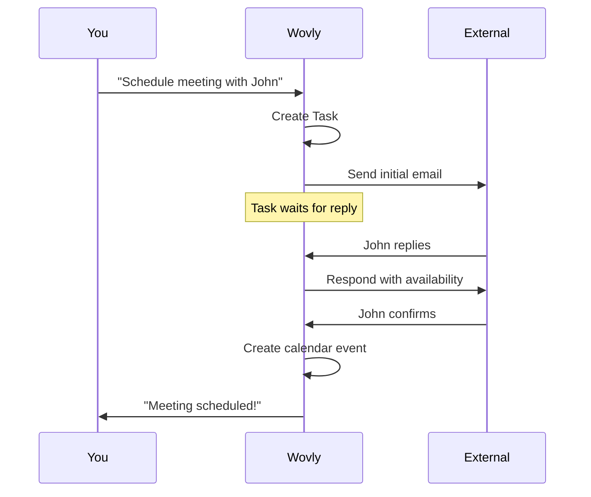

# Tasks

Tasks are autonomous background workflows that Wovly executes over time. Unlike chat (immediate responses), Tasks handle multi-step processes that may require waiting for replies, coordinating schedules, or following up over days.

## When to Use Tasks

<CardGroup cols={2}>
  <Card title="Scheduling" icon="calendar">
    "Schedule a meeting with John next week"
    
    Requires back-and-forth to find a time
  </Card>
  <Card title="Follow-ups" icon="clock">
    "Email the candidates and follow up until they respond"
    
    Monitors for replies over days
  </Card>
  <Card title="Coordination" icon="users">
    "Coordinate dinner plans with Sarah"
    
    Negotiates details through messages
  </Card>
  <Card title="Multi-step" icon="list-check">
    "Research contractors, email top 3, get quotes"
    
    Multiple sequential actions
  </Card>
</CardGroup>

## How Tasks Work



## Creating Tasks

### From Chat

When your request needs a Task, Wovly will offer to create one:

```
You: Email Jeff to schedule a meeting next week

Wovly: This will require back-and-forth to negotiate a time.
       Should I create a Task to handle the scheduling?

You: Yes

Wovly: Task created: "Schedule meeting with Jeff"
       I'll send the initial email and notify you of progress.
```

### Automatic

Some requests automatically become Tasks:

```
You: Follow up with the vendors until we get quotes

Wovly: Creating a Task to handle vendor follow-ups...
       Task created: "Get vendor quotes"
```

## Task States

| State | Description |
|-------|-------------|
| **Active** | Task is running and executing steps |
| **Waiting** | Task is waiting for external reply |
| **Pending Approval** | Task needs your input to continue |
| **Completed** | Task finished successfully |
| **Failed** | Task encountered an error |

## Viewing Tasks

Go to the **Tasks** page to see all tasks:

- Click a task to view its full history
- See the current step and plan
- View the execution log with timestamps

## Approvals

Some task actions require your approval:

### Message Approval

When a Task drafts a message, you'll see it in the task panel with options to:
- **Approve & Send** - Send as drafted
- **Edit** - Modify before sending
- **Reject** - Don't send

### Decision Points

When a Task needs input:

```
Task: Get vendor quotes

I received 3 quotes:
• ABC Plumbing: $450
• Quick Fix: $380
• Pro Services: $520

Should I proceed with the cheapest (Quick Fix)?

[Yes, proceed] [Let me review]
```

## Managing Tasks

### Cancel a Task

1. Go to **Tasks** page
2. Click the task
3. Click **Cancel Task**

Or in chat:
```
You: Cancel the vendor follow-up task
```

### Provide Input

When a task needs your input:
```
You: For the vendor task, go with ABC Plumbing
```

### Check Status

```
You: What's the status of my scheduling task?

Wovly: The "Schedule meeting with Jeff" task is waiting for 
       Jeff's reply. Last action: Sent availability options 
       2 hours ago.
```

## Messaging Channel Consistency

Tasks maintain consistent messaging channels throughout execution:

- If you say "text Jeff...", the task uses iMessage for all communication
- If you say "in Slack message...", the task uses Slack throughout
- The channel is locked at task creation and never switched

## Best Practices

<Tip>
  **Be specific about goals** - "Email John to get approval on the project timeline by Friday" is better than "Email John about the project"
</Tip>

<Tip>
  **Include timeframes** - "Schedule a meeting this week" helps prioritize follow-ups
</Tip>

<Tip>
  **Review drafts** - Always read proposed messages before approving
</Tip>

<Tip>
  **Use for repetitive work** - Tasks excel at follow-ups, scheduling, and coordination
</Tip>
