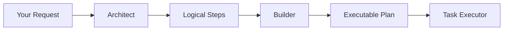
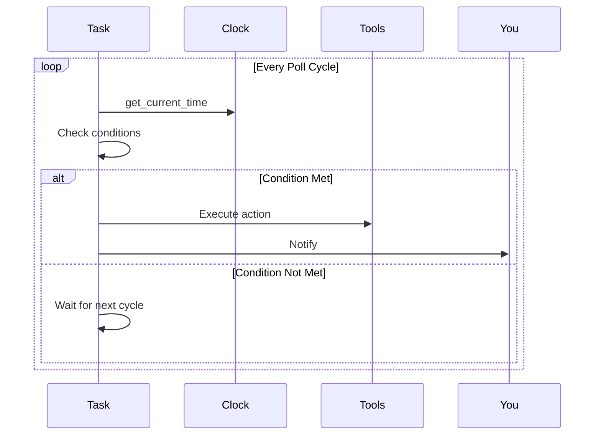
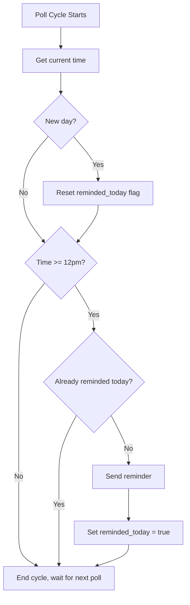

## Overview

Automated Tasks enable Wovly to perform scheduled or event-driven workflows in the background. From simple reminders to complex multi-step procedures, tasks run autonomously without your intervention. Schedule tasks to run at specific times, intervals, or in response to events like login, new messages, or calendar changes.

## When to Use Tasks

<CardGroup cols={2}>
  <Card title="Scheduling + Following Up" icon="calendar">
    "Schedule a meeting with John next week and follow up on a date"
    
    Requires back-and-forth to find a time
  </Card>
  <Card title="Follow-ups" icon="clock">
    "Email the candidates and follow up until they respond"
    
    Monitors for replies over days
  </Card>
  <Card title="Reminders" icon="bell">
    "Remind me to take my medication at 9am daily"
    
    Time-based recurring notifications
  </Card>
  <Card title="Monitoring" icon="eye">
    "Watch my inbox for emails from the client"
    
    Continuous event monitoring
  </Card>
</CardGroup>

## How Tasks Work

### The Architect-Builder System

When you create a task, Wovly uses a two-stage AI system to plan and execute it:



1. **The Architect** analyzes your intent and creates logical steps
2. **The Builder** maps those steps to specific tools and actions
3. **The Executor** runs the plan, handling timing and state

### Polling-Based Execution

Tasks run on a polling model—they execute at regular intervals rather than continuously:



<Note>
Tasks can be configured to poll at different intervals: every minute for urgent monitoring, hourly for less time-sensitive tasks, or triggered on app login for daily reports.
</Note>

## Task Types

| Type | Description | Example |
|------|-------------|---------|
| **Discrete** | Has an end goal, completes when done | "Schedule meeting with John" |
| **Continuous** | Runs indefinitely until cancelled | "Remind me at 12pm daily" |

## Task Primitive Tools

Tasks have access to fundamental tools that enable sophisticated workflows:

### Variable Management

Tasks can save and retrieve information across execution cycles:

| Tool | Description |
|------|-------------|
| `save_variable` | Store a value (e.g., `target_time`, `reminded_today`) |
| `get_variable` | Read a stored value |
| `check_variable` | Check if a variable exists or equals a value |

### Time Operations

Built-in tools for time-based logic:

| Tool | Description |
|------|-------------|
| `get_current_time` | Get current date/time |
| `parse_time` | Convert "12pm" to hour/minute |
| `check_time_passed` | Check if current time has passed target |
| `is_new_day` | Check if calendar day changed |

### Control Flow

Tools for task logic and flow:

| Tool | Description |
|------|-------------|
| `evaluate_condition` | Compare values (equals, not equals, greater than, less than, contains) |
| `goto_step` | Jump to a specific step in the plan |
| `complete_task` | Mark task as finished |

### Communication

Ways for tasks to interact with you:

| Tool | Description |
|------|-------------|
| `send_reminder` | Display a reminder message |
| `notify_user` | Send status updates |
| `send_chat_message` | Send any message to chat |
| `ask_user_question` | Ask a question and wait for your reply |

## Example: Daily Reminder

Here's how a "remind me at 12pm daily" task works internally:



## Creating Tasks

### From Chat

When your request needs a Task, Wovly will analyze it and offer a plan:

```
You: Remind me to take my vitamins at 9am every day

Wovly: I've analyzed your request and created a plan:

**Daily Vitamin Reminder**

1. Parse and save target time (9:00 AM)
2. Check if it's a new day (reset reminder flag)
3. Get current time
4. Check if target time has passed
5. If time passed and not reminded: send reminder
6. Save "reminded today" status

This is a continuous task that will run until cancelled.
Should I create this task?
```

### Interactive Tasks

Tasks can ask you questions mid-execution:

```
Task: Research competitors

I found 15 potential competitors. Which industry 
segment should I focus on?

Options:
1. Enterprise SaaS
2. SMB Tools  
3. Consumer Apps

[Reply in chat to continue]
```

Your response is saved and the task continues with your input.

## Task States

| State | Description |
|-------|-------------|
| **Active** | Task is running and executing steps |
| **Waiting** | Task is waiting for external event (reply, time) |
| **Waiting for Input** | Task needs your answer to continue |
| **Pending Approval** | Task drafted a message for your review |
| **Completed** | Task finished successfully |
| **Failed** | Task encountered an error |

## Viewing Tasks

Go to the **Tasks** page to see all tasks:

- Click a task to view its full history
- See the current step and execution plan
- View the execution log with timestamps
- See stored variables and context

## Approvals

Some task actions require your approval:

### Message Approval

When a Task drafts a message, you'll see it in the task panel with options to:
- **Approve & Send** - Send as drafted
- **Edit** - Modify before sending
- **Reject** - Don't send

### Decision Points

When a Task needs input:

```
Task: Get vendor quotes

I received 3 quotes:
• ABC Plumbing: $450
• Quick Fix: $380
• Pro Services: $520

Should I proceed with the cheapest (Quick Fix)?

[Yes, proceed] [Let me review]
```

## Managing Tasks

### Cancel a Task

1. Go to **Tasks** page
2. Click the task
3. Click **Cancel Task**

Or in chat:
```
You: Cancel the reminder task
```

### Provide Input

When a task asks a question:
```
You: Focus on Enterprise SaaS competitors
```

### Check Status

```
You: What's the status of my scheduling task?

Wovly: The "Schedule meeting with Jeff" task is waiting for 
       Jeff's reply. Last action: Sent availability options 
       2 hours ago.
```

## Poll Interval Configuration

Tasks can be configured with different polling frequencies:

| Interval | Use Case |
|----------|----------|
| **1 minute** | Time-sensitive reminders, urgent monitoring |
| **5 minutes** | Regular inbox checks |
| **1 hour** | Periodic status updates |
| **On login** | Daily reports, morning briefings |

## Best Practices

<Tip>
  **Be specific about goals** - "Email John to get approval on the project timeline by Friday" is better than "Email John about the project"
</Tip>

<Tip>
  **Include timeframes** - "Schedule a meeting this week" helps prioritize follow-ups
</Tip>

<Tip>
  **Review drafts** - Always read proposed messages before approving
</Tip>

<Tip>
  **Use continuous tasks for monitoring** - "Alert me when I get an email from the client" runs until you cancel it
</Tip>

<Tip>
  **Respond to questions promptly** - Tasks waiting for your input are paused until you reply
</Tip>
